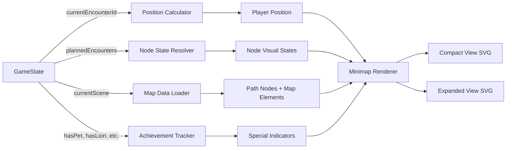

# Design Document: Minimap-Game-Correlation

## Overview

La característica **Minimap-Game-Correlation** transforma el minimapa del juego de un componente estático con datos hardcodeados a un sistema dinámico que refleja el progreso real del jugador en tiempo real.

### Problem Statement

Actualmente, el minimapa (`src/components/Minimap.tsx`) muestra información estática que no refleja el estado real del juego:
- Enemigos derrotados siguen apareciendo como activos
- Eventos completados no se marcan visualmente
- La posición del jugador no se actualiza según el progreso en la escena
- No hay correlación entre `gameState.currentEncounterId` y la visualización del mapa

Este desacoplamiento crea confusión para el jugador y rompe la inmersión, ya que el minimapa no sirve como herramienta de orientación confiable.

### Proposed Solution

Rediseñar el minimapa para que:
1. **Calcule dinámicamente** la posición del jugador basándose en `currentEncounterId`
2. **Renderice estados visuales diferenciados** para encuentros completados, activos y pendientes
3. **Oculte o atenúe** elementos de mapa (edificios, NPCs) asociados a encuentros completados
4. **Mantenga consistencia** entre la vista compacta y expandida del minimapa
5. **Se reinicie correctamente** al cambiar de escena, cargando los datos correspondientes
6. **Refleje logros especiales** como mascotas rescatadas o habilidades desbloqueadas

La solución se implementa sin modificar la estructura de datos de `GameState`, utilizando solo las propiedades existentes (`currentEncounterId`, `plannedEncounters`, `currentScene`, `hasPet`, `hasLion`, `transformationUnlocked`).

## Architecture

### Component Structure

```
Minimap (src/components/Minimap.tsx)
├── Compact View (HUD minimap)
│   ├── Path visualization (SVG)
│   ├── Path nodes with state
│   ├── Player marker (dynamic position)
│   └── Static elements (buildings, NPCs)
└── Expanded View (tactical map overlay)
    ├── Map canvas (SVG detailed visualization)
    ├── Information panel
    │   ├── Context-aware info box (hover tooltips)
    │   ├── Progress indicator
    │   └── Special achievements display
    └── Legend and controls
```

### Data Flow



### State Management

El componente Minimap es **stateless** respecto al progreso del juego (no mantiene su propio estado de progreso). Todo el estado proviene de `gameState` props:

- **Source of Truth**: `GameState.currentEncounterId` y `GameState.plannedEncounters`
- **Derived State**: Todas las visualizaciones son computadas en cada render basándose en el estado del juego
- **Local UI State**: Solo mantiene estado para interactividad UI (`isExpanded`, `hoveredElement`)

## Components and Interfaces

### Modified Interfaces

```typescript
// Extension to existing MapElement interface
interface MapElement {
  name: string;
  x: number; // 0-100
  y: number; // 0-100
  desc: string;
  linkedEncounterId?: number; // NEW: Optional link to encounter index
}

// Existing interfaces remain unchanged:
// - MinimapProps
// - GameState
// - SceneId
```

### Key Functions

#### 1. `getPathNodeType(index: number): NodeType`

```typescript
type NodeType = 'start' | 'end' | 'enemy' | 'mission' | 'rune' | 'unknown';

// Determines the type of encounter at a given path index
// Uses plannedEncounters[index - 1] to check encounter type
// Returns 'start' for index 0, 'end' for last index
```

**Behavior:**
- `index === 0` → `'start'`
- `index === pathPoints.length - 1` → `'end'`
- `encounter.startsWith('event:rune-alignment')` → `'rune'`
- `encounter.startsWith('event:')` → `'mission'`
- Otherwise → `'enemy'`

#### 2. `getPathNodeVisualState(index: number, currentEncounterId: number): VisualState`

```typescript
type VisualState = 'completed' | 'active' | 'pending';

// Determines visual state based on index relative to progress
// NEW function to be implemented
```

**Behavior:**
- `index < currentEncounterId` → `'completed'`
- `index === currentEncounterId` → `'active'`
- `index > currentEncounterId` → `'pending'`

#### 3. `calculatePlayerPosition(currentEncounterId: number, pathPoints: Point[]): Point`

```typescript
interface Point { x: number; y: number; }

// Returns the coordinates of the player based on current encounter
// Currently uses: pathPoints[Math.min(currentEncounterId, pathPoints.length - 1)]
// This is correct and doesn't need changes
```

#### 4. `getNodeColorClasses(type: NodeType, state: VisualState): string`

```typescript
// Returns Tailwind CSS classes for node appearance based on type and state
// NEW function to be implemented
```

**Behavior:**
| Type | State | Color Classes |
|------|-------|---------------|
| enemy | completed | `fill-red-950/80 stroke-red-900/30` |
| enemy | active | `fill-red-950/40 stroke-red-500 stroke-[1.5px]` |
| enemy | pending | `fill-red-950/40 stroke-red-500 stroke-[1.5px]` |
| mission | completed | `fill-purple-950/80 stroke-purple-900/30` |
| mission | active | `fill-purple-950/40 stroke-purple-500 stroke-[1.5px]` |
| mission | pending | `fill-purple-950/40 stroke-purple-500 stroke-[1.5px]` |
| rune | completed | `fill-cyan-950/80 stroke-cyan-900/30` |
| rune | active | `fill-cyan-950/40 stroke-cyan-300 stroke-[1.5px]` |
| rune | pending | `fill-cyan-950/40 stroke-cyan-300 stroke-[1.5px]` |

#### 5. `shouldRenderMapElement(element: MapElement, currentEncounterId: number): boolean`

```typescript
// Determines if a map element should be visible
// NEW function to be implemented
```

**Behavior:**
- If `element.linkedEncounterId` is undefined → `true` (always visible)
- If `element.linkedEncounterId < currentEncounterId` → `false` (hide completed)
- Otherwise → `true`

#### 6. `getVisitedPathSegment(pathPoints: Point[], currentEncounterId: number): string`

```typescript
// Returns SVG path string for visited portion of route
// NEW function to be implemented
```

**Behavior:**
```typescript
if (currentEncounterId === 0) return '';
const visitedPoints = pathPoints.slice(0, currentEncounterId + 1);
return `M ${visitedPoints.map(p => `${p.x} ${p.y}`).join(' L ')}`;
```

### Icon Mapping

```typescript
// Type to Icon mapping (already exists, but needs enforcement)
const ENCOUNTER_ICON_MAP = {
  enemy: <Skull />,
  'event:chest': <Gift />,
  'event:shrine': <Sparkles />,
  'event:rune-alignment': <Sparkles className="text-cyan-300" />,
  'event:pet': <User className="text-emerald-400" />,
  'event:lion': <User className="text-orange-400" />,
  'event:friend-relic': <Sparkle />
};
```

## Data Models

### MapData Configuration

The existing `mapData` structure needs enhancement to support `linkedEncounterId`:

```typescript
const mapData: Record<SceneId, SceneMapData> = {
  'beach': {
    title: 'Playa de los Lamentos',
    region: 'Las Playas del Olvido',
    start: { x: 15, y: 80 },
    end: { x: 90, y: 20 },
    encounterPoints: [
      { x: 35, y: 65 }, // shadow-1 (index 0)
      { x: 55, y: 50 }, // event:chest (index 1)
      { x: 75, y: 35 }  // shadow-2 (index 2)
    ],
    buildings: [
      { 
        name: 'Faro Derruido', 
        x: 82, 
        y: 15, 
        desc: 'Un faro antiguo cubierto de musgo y sal.',
        linkedEncounterId: 2 // Linked to shadow-2 encounter
      },
      { 
        name: 'Choza Abandonada', 
        x: 25, 
        y: 85, 
        desc: 'El refugio podrido de un viejo marinero.',
        // No linkedEncounterId - always visible
      }
    ],
    npcs: [
      { 
        name: 'Náufrago Misterioso', 
        x: 45, 
        y: 75, 
        desc: 'Un viejo que murmura sobre sombras gigantescas.',
        // No linkedEncounterId - always visible
      }
    ]
  },
  // ... other scenes
};
```

### Path Points Construction

```typescript
// Existing logic (correct, no changes needed):
const pathPoints = [
  currentMap.start,              // Index 0: start point
  ...currentMap.encounterPoints, // Indices 1 to N: encounters
  currentMap.end                 // Index N+1: end point
];

// Mapping:
// pathPoints[0] = start (not an encounter)
// pathPoints[i] = encounterPoints[i-1] = plannedEncounters[i-1] for i > 0 and i < pathPoints.length - 1
// pathPoints[pathPoints.length - 1] = end (not an encounter)
```

### Tooltip Data Model

```typescript
interface TooltipData {
  name: string;
  desc: string;
  type: 'player' | 'enemy' | 'mission' | 'rune' | 'building' | 'npc' | 'start' | 'end';
  state?: 'completed' | 'active' | 'pending'; // For encounter nodes
  x: number;
  y: number;
}
```

## Correctness Properties

*Una propiedad es una característica o comportamiento que debe cumplirse en todas las ejecuciones válidas de un sistema—esencialmente, una declaración formal sobre lo que el sistema debe hacer. Las propiedades sirven como puente entre especificaciones legibles por humanos y garantías de corrección verificables por máquina.*

### Property 1: Node Visual State Correctness

*For any* game state with valid `currentEncounterId` and `plannedEncounters`, all path nodes SHALL be rendered with visual states that correctly reflect their position relative to `currentEncounterId`: nodes with index < `currentEncounterId` are "completed", the node at index = `currentEncounterId` is "active", and nodes with index > `currentEncounterId` are "pending".

**Validates: Requirements 1.2, 1.3, 1.4**

### Property 2: Encounter Type to Icon Mapping

*For any* encounter in `plannedEncounters`, the rendered node SHALL display an icon and color that correctly corresponds to its encounter type according to the defined mapping (enemy → Skull/red, event:chest → Gift/purple, event:rune-alignment → Sparkles/cyan, etc.).

**Validates: Requirements 2.1, 2.2, 2.3, 2.4, 2.5, 2.6**

### Property 3: Player Position Accuracy

*For any* valid `currentEncounterId`, the calculated `playerPos` SHALL equal `pathPoints[currentEncounterId]`, accurately placing the player marker on the map at the current encounter location.

**Validates: Requirements 1.5**

### Property 4: Map Element Visibility Based on Completion

*For any* `MapElement` with a defined `linkedEncounterId`, that element SHALL be hidden or attenuated when `linkedEncounterId < currentEncounterId`, and SHALL be visible with normal opacity when `linkedEncounterId >= currentEncounterId` or when `linkedEncounterId` is undefined.

**Validates: Requirements 3.1, 3.2, 3.3**

### Property 5: Visited Path Rendering

*For any* `currentEncounterId > 0`, the Minimap_Expanded SHALL render a "visited path" SVG element that connects pathPoints[0] through pathPoints[currentEncounterId] with a distinctive color (cyan/emerald), and this path SHALL be visually distinct from the complete route path.

**Validates: Requirements 4.1, 4.2**

### Property 6: Complete Route Path Presence

*For any* game state, the Minimap SHALL render a complete route path connecting all pathPoints with reduced opacity (0.2-0.3) and dashed stroke style.

**Validates: Requirements 4.4**

### Property 7: Cross-View Consistency

*For any* game state, the visual state of all encounter nodes (completed/active/pending) and the calculated `playerPos` SHALL be identical between the compact minimap and the expanded minimap views.

**Validates: Requirements 6.1, 6.2, 6.3**

### Property 8: Progress Indicator Accuracy

*For any* game state, the Minimap_Expanded SHALL display a progress indicator showing "Encuentro {currentEncounterId + 1} de {plannedEncounters.length}" when `currentEncounterId < plannedEncounters.length`, and SHALL display "Zona Completada ✓" when `currentEncounterId >= plannedEncounters.length`.

**Validates: Requirements 7.1, 7.2**

### Property 9: Scene Change Data Reload

*For any* scene change (when `currentScene` changes), the Minimap SHALL reload all map data from `mapData[currentScene]`, including pathPoints, buildings, NPCs, and SHALL reset visual states to reflect the new scene's `plannedEncounters` and `currentEncounterId`.

**Validates: Requirements 8.1, 8.2, 8.4**

### Property 10: Initial Position on Scene Entry

*For any* scene entry where `currentEncounterId === 0`, the `playerPos` SHALL equal `mapData[currentScene].start`.

**Validates: Requirements 8.3**

### Property 11: Special Achievement Indicators

*For any* game state where `hasPet === true`, `hasLion === true`, or `transformationUnlocked === true`, the Minimap_Expanded SHALL display corresponding visual indicators (pet icon, lion icon, ascension indicator) in the information panel, and these indicators SHALL remain visible across all subsequent scenes.

**Validates: Requirements 10.1, 10.2, 10.3, 10.4**

## Error Handling

### Invalid State Handling

1. **Out-of-bounds `currentEncounterId`**:
   ```typescript
   const safeEncounterId = Math.min(
     Math.max(0, currentEncounterId), 
     plannedEncounters.length
   );
   ```

2. **Missing scene data**:
   ```typescript
   const currentMap = mapData[currentScene] || mapData['beach']; // Fallback to beach
   ```

3. **Empty `plannedEncounters`**:
   - If `plannedEncounters.length === 0`, render only start and end nodes
   - Don't attempt to render encounter nodes
   - Display "No encounters in this scene" in progress indicator

4. **Missing `linkedEncounterId` in Map_Elements**:
   - Treat as always visible (no filtering applied)
   - Log warning if element name suggests it should be linked

### React Error Boundaries

No error boundaries are needed at the Minimap level since it's a pure presentation component. Parent components (`App.tsx`) should handle state corruption.

### Defensive Rendering

```typescript
// Guard against null/undefined
if (!gameState || !gameState.plannedEncounters) {
  return <div className="error">Invalid game state</div>;
}

// Guard against invalid scene
if (!VALID_SCENES.includes(currentScene)) {
  console.error(`Invalid scene: ${currentScene}`);
  return null;
}
```

## Testing Strategy

### Unit Testing (Example-Based)

**Focus**: Specific edge cases and UI interactions

1. **Empty encounters list**: Verify only start/end nodes render
2. **All encounters completed**: Verify "Zona Completada ✓" message
3. **Hover interactions**: Simulate mouseEnter/mouseLeave and verify tooltip content
4. **Expand/collapse toggle**: Verify isExpanded state changes and keyboard shortcuts work
5. **Scene with no linked elements**: Verify all buildings/NPCs always visible

### Property-Based Testing

**Library**: `fast-check` (for JavaScript/TypeScript)

**Configuration**: Minimum 100 iterations per property

Each property test must include a comment tag:
```typescript
// Feature: minimap-game-correlation, Property {N}: {property text}
```

**Test Structure Example**:

```typescript
import fc from 'fast-check';
import { render } from '@testing-library/react';

// Feature: minimap-game-correlation, Property 1: Node Visual State Correctness
test('all nodes render with correct visual state relative to currentEncounterId', () => {
  fc.assert(
    fc.property(
      fc.record({
        currentEncounterId: fc.nat({ max: 10 }),
        plannedEncounters: fc.array(
          fc.oneof(
            fc.constant('enemy-1'),
            fc.constant('event:chest'),
            fc.constant('event:rune-alignment')
          ),
          { minLength: 1, maxLength: 10 }
        ),
        currentScene: fc.constantFrom('beach', 'forest', 'ruins', 'city', 'final-boss')
      }),
      (gameState) => {
        // Render Minimap with generated gameState
        const { container } = render(<Minimap gameState={gameState} />);
        
        // Extract rendered nodes
        const completedNodes = container.querySelectorAll('[data-state="completed"]');
        const activeNodes = container.querySelectorAll('[data-state="active"]');
        const pendingNodes = container.querySelectorAll('[data-state="pending"]');
        
        // Assert correct counts
        const expectedCompleted = gameState.currentEncounterId;
        const expectedActive = 1;
        const expectedPending = gameState.plannedEncounters.length - gameState.currentEncounterId - 1;
        
        expect(completedNodes.length).toBe(expectedCompleted);
        expect(activeNodes.length).toBe(expectedActive);
        expect(pendingNodes.length).toBe(expectedPending);
      }
    ),
    { numRuns: 100 }
  );
});
```

**Generators Needed**:

```typescript
// Valid game state generator
const gameStateArbitrary = fc.record({
  currentScene: fc.constantFrom<SceneId>('beach', 'forest', 'ruins', 'city', 'final-boss'),
  currentEncounterId: fc.nat({ max: 10 }),
  plannedEncounters: fc.dictionary(
    fc.constantFrom<SceneId>('beach', 'forest', 'ruins', 'city', 'final-boss'),
    fc.array(encounterIdArbitrary, { minLength: 0, maxLength: 10 })
  ),
  hasPet: fc.boolean(),
  hasLion: fc.boolean(),
  player: fc.record({
    transformationUnlocked: fc.boolean(),
    // ... other player properties
  })
});

// Encounter ID generator
const encounterIdArbitrary = fc.oneof(
  fc.constant('shadow-1'),
  fc.constant('ghoul-1'),
  fc.constant('event:chest'),
  fc.constant('event:shrine'),
  fc.constant('event:rune-alignment'),
  fc.constant('event:pet'),
  fc.constant('event:lion'),
  fc.constant('event:friend-relic')
);
```

### Integration Testing

**Focus**: Dynamic behavior and animations

1. **Scene transition**: Change `currentScene`, verify map data reloads
2. **Encounter progression**: Increment `currentEncounterId`, verify animations trigger
3. **Responsive design**: Test on different viewport sizes
4. **Accessibility**: Verify keyboard navigation and screen reader compatibility

### Visual Regression Testing

Use snapshot testing for:
- Compact minimap appearance for each scene
- Expanded minimap appearance for each scene
- Progress indicator states (in-progress vs. completed)
- Icon rendering for all encounter types

**Tools**: Jest snapshots or Storybook visual regression

### Performance Testing

- **Large encounter lists**: Test with 20+ encounters to ensure smooth rendering
- **Rapid state changes**: Simulate fast `currentEncounterId` updates
- **Animation performance**: Verify 60fps during transitions

## Implementation Notes

### Refactoring Approach

1. **Phase 1: Add data attributes for testing**
   - Add `data-state` attributes to nodes for visual state
   - Add `data-encounter-type` attributes to nodes for type
   - Add `data-encounter-index` attributes to nodes

2. **Phase 2: Extract helper functions**
   - Extract `getPathNodeVisualState()` from inline logic
   - Extract `getNodeColorClasses()` from inline conditionals
   - Extract `shouldRenderMapElement()` for filtering logic

3. **Phase 3: Implement visibility filtering**
   - Add `linkedEncounterId` to relevant MapElements in `mapData`
   - Implement filtering in rendering logic for buildings and NPCs

4. **Phase 4: Add visited path rendering**
   - Implement `getVisitedPathSegment()` function
   - Add new SVG path element in Expanded View
   - Apply distinct styling (cyan/emerald color, shadow effect)

5. **Phase 5: Update progress indicator**
   - Add conditional rendering for "Zona Completada ✓"
   - Ensure dynamic updates on `currentEncounterId` change

6. **Phase 6: Add special achievement indicators**
   - Implement conditional rendering based on `hasPet`, `hasLion`, `transformationUnlocked`
   - Style indicators to be visually distinct

### Code Organization

```
src/components/
├── Minimap.tsx (main component)
└── minimap/
    ├── helpers.ts (pure functions: getPathNodeType, getPathNodeVisualState, etc.)
    ├── constants.ts (ENCOUNTER_ICON_MAP, COLOR_CLASSES, etc.)
    ├── types.ts (TooltipData, VisualState, NodeType, etc.)
    └── __tests__/
        ├── Minimap.test.tsx (unit tests)
        ├── Minimap.properties.test.tsx (property-based tests)
        └── helpers.test.ts (helper function tests)
```

### Dependencies

No new dependencies required. Use existing:
- `motion/react` for animations
- `lucide-react` for icons
- `react` for rendering

### Accessibility Considerations

- Add `aria-label` to all interactive elements (nodes, expand button)
- Ensure keyboard navigation works (Tab, Enter, Escape, +)
- Provide text alternatives for visual states in tooltips
- Use semantic HTML and ARIA roles appropriately
- Ensure sufficient color contrast for all states

### Performance Optimizations

1. **Memoization**: Memoize `pathPoints` calculation and `mapData` lookup
   ```typescript
   const pathPoints = useMemo(() => [
     currentMap.start,
     ...currentMap.encounterPoints,
     currentMap.end
   ], [currentScene]);
   ```

2. **Conditional rendering**: Don't render Minimap for intro/ending scenes
   ```typescript
   if (currentScene === 'intro' || currentScene === 'ending') return null;
   ```

3. **SVG optimization**: Use `contentVisibility: auto` for off-screen elements

4. **Animation performance**: Use CSS transforms and opacity (GPU-accelerated)

